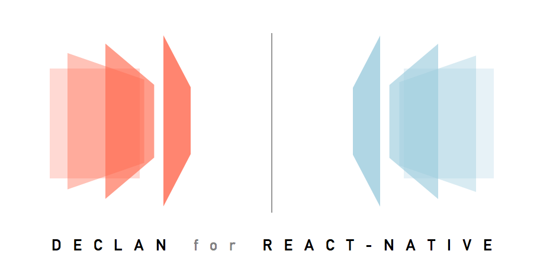

<h1 align="center">
  
  <br>
  <br>
  Declarative Animations for React Native
</h1>

Declan is a library that makes it easy to incorporate declarative animations and interactions into your React Native app. It's inspired heavily by the [UX](https://www.fusetools.com/docs/declarative-animation) language created by Fuse.

## Demos

<p align="center">
  
  
  <br />
  
  
</p>

### Run the demo app on Expo
https://expo.io/@akalyan/examples

### Build and run the demo app on your computer
Clone the repo and run:
```
cd examples
yarn
yarn start
```
...then scan the QR code in the Expo app.

## Installation
> npm install --save react-native-declan

or

> yarn add react-native-declan

## Usage

We suggest reading the Fuse [documentation for Animations](https://www.fusetools.com/docs/declarative-animation) to get a better sense for what react-native-declan strives to be and how to implement compelling user interactions with a truly declarative API. In lieu of that, here is a summary.

There are several entities that react-native-declan comprises:
- `Animator`s - descriptions of how components change
- `Trigger`s - stimuli that invoke change, wrap a set of `Animator`s
- Higher-Order `Animator`s - like the offspring of `Animator` and `Trigger`, wrap and invoke a set of `Animator`s, but also behave like an `Animator`
- `Components` - what will change
- `Behaviors` - give `Component`s capabilities or detects gestures that are used by `Trigger`s

### Animators

Animators describe how components will change. There are a handful of basic animators to use: Move, Rotate, Scale, Fade.

New, more complex, animators can be built by combining those basic animators. For an example of this, see the [Shake](https://github.com/ChefSteps/react-native-declan/blob/master/src/animators/Shake.js). These new animators should have the same behavior as the basic animators.

Animators essentially wrap the [Animated.timing](https://facebook.github.io/react-native/docs/animated.html#timing) API twice -- once running forward, and another running backward.

Example:
```
<Move
  getTargetRef={() => elementToMove}
  x={80}
  duration={1000}
  easing={Easing.bounce}
  durationBack={500}
  easing={Easing.linear}
/>
```

The above snippet describes a movement of the component referenced by `elementToMove`, which will move right 80 pixels over 1 second with a bounce easing curve...when triggered.

#### Supported Animators

| Name | Props | Description | Notes |
| ---- | ------| ----------- | --------- |
| `Move` | `x`: number, `y`: number | Translate by `x` or `y` or both | - |
| `Scale` | `x`: number, `y`: number, `factor`: number | Scale by `x` or `y` or `factor` (both) from center of `AnimatableView` | - |
| `Rotate` | `degrees`: number, `degreesX`: number, `degreesY`: number, `degreesZ`: number | Rotate reference `AnimatableView` by props from center | `degrees` is an alias of `degreesZ` |
| `Fade` | `value`: number | Chance opacity of referenced `AnimatableView` to `value` | - |
| `Change` | `field`: string, `value`: number | Chance a style property `field` of referenced `AnimatableView` to `value` | (1) Only one of these can apply to an `AnimatableView`, (2) This `Animator` does not use the native driver, so use sparingly! |
| `DebugAction` | `message`: string | Just prints the message to the console (does nothing in reverse) | - |
| `Callback` | `action`: () => any | Calls the action (does nothing in reverse) | - |

All of the visual `Animator`s above (`Move`, `Scale`, `Rotate`, `Fade`, `Change`) also take the following props:

| Prop | Type | Description |
| ---- | ---- | ----------- |
| `getTargetRef` | () => `AnimatableView` | Function that returns the `AnimatableView` the `Animator` should apply to |
| `initialValue` | number or `{ x: number, y: number }` | Depending on the type of Trigger used, you may need to specify where the `Animator` should return to. Some just take a value (e.g. `Fade`), while others take `x` and `y` (e.g. `Move`) |
| `onFinish` | () => void | Callback called when `Animator` finishes playing forward |
| `onFinishBack` | () => void | Callback called when `Animator` finishes playing backward |
| `duration` | number | Duration of forward animation |
| `durationBack` | number | Duration of backward animation |
| `delay` | number | Delay before starting forward animation |
| `delayBack` | number | Delay before starting backward animation |
| `easing` | `Easing` | [Easing](https://facebook.github.io/react-native/docs/easing.html) function to apply to forward animation |
| `easingBack` | `Easing` | [Easing](https://facebook.github.io/react-native/docs/easing.html) function to apply to backward animation |
| `extrapolate` | `'extend'` or `'clamp'` | Extrapolation setting for driver-based `Animator` |
| `extrapolateLeft` | `'extend'` or `'clamp'` | Extrapolation setting for driver-based `Animator` |
| `easingBack` | `'extend'` or `'clamp'` | Extrapolation setting for driver-based `Animator` |

### Triggers

Triggers actually cause change to happen. This is where we take the user's actions into account. There are three types of triggers:
- Pulse triggers - play a set of animators forward)
- While triggers - play forward while a condition is met, and play backward otherwise)
- Gesture-responsive triggers - animators that play in response to, and in proportion to, some user gesture

#### Supported triggers

| Name | Props | Description | Notes |
| ---- | ------| ----------- | --------- |
| `ManualTrigger` | - | A wrapper for a set of `Animator`s that you can trigger by calling `.start()` | - |
| `Mounted` | - | Triggers its `Animator`s when this trigger is mounted | Put this at the bottom of the component tree to ensure it mounts last |
| `WhileTrue` | `value`: boolean | Triggers its `Animator`s when `value` evaluates to true, stops the `Animator`s when false | - |
| `ScrollPositionAnimation` | `from`: number, `to`: number, `driver`: `ScrollDriver` | Gesture-based trigger that plays its `Animator`s forward when `ScrollView` is scrolled from `from` to `to` | See [Scroll Position Demo](https://github.com/ChefSteps/react-native-declan/blob/master/examples/views/ScrollPositionDemo/index.js) for an example of how to hook it up to the `ScrollView` |
| `WhileScrolling` | `direction`: `up`, `down`, or `either`, `driver`: `ScrollDriver` | Plays forward when associated `ScrollView` is scrolling in `direction`, otherwise plays backward | See [Scroll Direction Demo](https://github.com/ChefSteps/react-native-declan/blob/master/examples/views/ScrollDirectionDemo/index.js) for an example of how to hook it up to the `ScrollView` |
| `StateGroup` | `defaultState`: string | This is a sort of wrapper Trigger for `State` | Trigger a specific state by calling `goToState` on this component's ref |
| `State` | `name`: string | Will trigger its `Animator`s when parent `StateGroup` changes to this state, and play backward when changed away from this state | - |
| `SwipingAnimation` | `getSourceRef`: () => `SwipeGesture` | Plays forward when associated `SwipeGesture` is swiped forward and returns to resting state when going backward | See [Swipe Demo](https://github.com/ChefSteps/react-native-declan/blob/master/examples/views/SwipeDemo/index.js) for examples of how to hook it up to a swipe-able view |
| `Swiped` | `getSourceRef`: () => `SwipeGesture`, `how`: `toActive`, `toInactive`, or `toEither` | Triggered when the associated `SwipeGesture` is swiped | See [Swipe Demo](https://github.com/ChefSteps/react-native-declan/blob/master/examples/views/SwipeDemo/index.js) for examples of how to hook it up to a swipe-able view |

### Higher-Order animators

| Name | Props | Description |
| ---- | ----- | ----------- |
| `Parallel` | - | When started, plays all its children forward, when stopped plays them backward |
| `Cycle` | - | Plays its children `Animator`s playing forward, and restarts them all when the last one finishes playing |
| `Sequence` | - | Plays each child `Animator` forward one-by-one (when the first finishes, second one beings, etc.) |
| `Stagger` | `eachDelay`: number | When started, plays each child `Animator` with delay `eachDelay` between then, same behavior on stop |

All of the higher-order components also pass onto its children the following properties:
- `getTargetRef`
- `x`
- `y`
- `initialValue`
- `value`
- `duration`
- `easing`
- `delay`
- `durationBack`
- `easingBack`
- `delayBack`

See the [Stagger Demo](https://github.com/ChefSteps/react-native-declan/blob/master/examples/views/StaggerDemo/index.js) for usage example.

### Components

Finally, react-native-declan has a set of components that can be manipulated through animators and triggers. Right now, the only component is a static view, but that will soon change.

### Behaviors

> Note: this may change in the future as we determine whether the `Behavior` model or the `Driver` model is more appropriate for react-native.

| Name | Prop | Description |
| ---- | ----- | ----------- |
| `SwipeGesture`* | `type`: `active` | Only type supported right now |
| | `direction`: `left`, `right`, `up`, or `down` | Direction to detect the swipe. Will also detect a swipe in the opposite direction to go back to `inActive` state |
| | `length`: number | How long does the user need to swipe for it be considered "successful" (note, also fast swipes will count as success) |
| | `edge`: `left`, `right`, `top`, `bottom` | To only enable swipes from the edge of an element |
| | `hitSize`: number | For `edge`, how far from the edge is in play to start the gesture |
| | | * See [Swipe Demo](https://github.com/ChefSteps/react-native-declan/blob/master/examples/views/SwipeDemo/index.js) for examples of how to hook it up to a swipe-able view by using the `PanEventEmitter` |

## Contributing
If you are interested in contributing to react-native-declan or have feedback, please contact us. Pull requests are also welcome.

## License
[MIT](https://github.com/ChefSteps/react-native-declan/blob/master/LICENSE)
